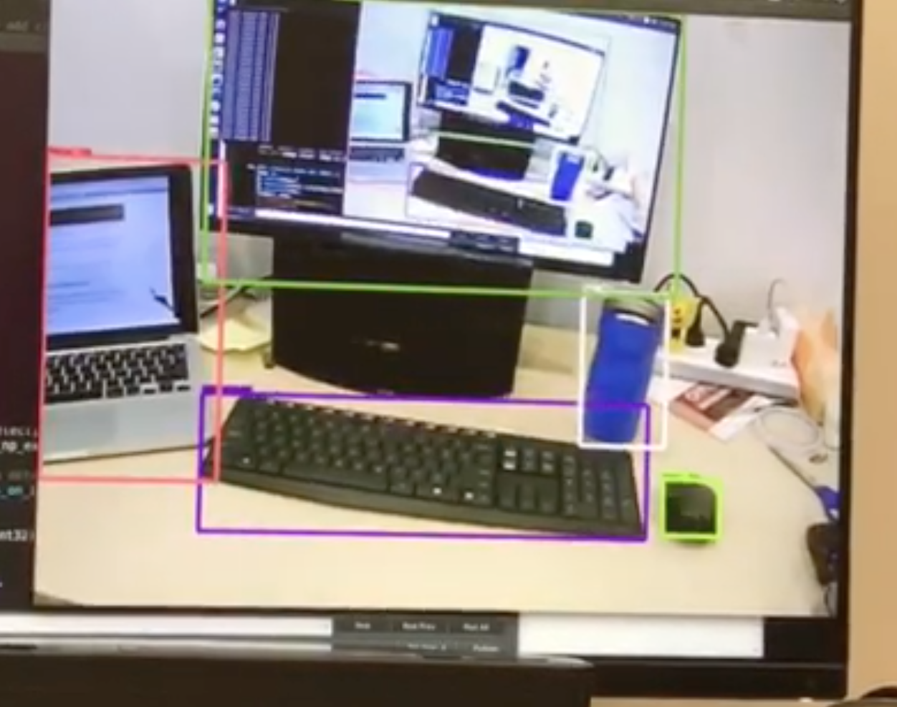

# Real-Time Object Detection

## Usage 
1. Download models-master from GitHub (Tensroflow)
2. Make sure you have `tensorflow==1.2.0` installed. 
2. Put object-detection.py and utils.py to `/models-master/research/
`
3. Put `ssd_mobilenet_v1_coco_11_06_2017` in `/models-master/research/object_detection/`
4. Install Google's protoc: 
	[https://github.com/google/protobuf/blob/master/src/README.md](https://github.com/google/protobuf/blob/master/src/README.md)
5. Install OpenCV 
6. If you are prompted with `ImportError: No module named google.protobuf`, try this: 

		sudo pip uninstall protobuf
		sudo pip install protobuf
	
6. Open terminal, cd to `/models-master/research/`, run `python object-detection.py `
6. When you want to quit this program, click the webcam window and then type 'q' on the keyboard. 

## Demo:
